사회학과 2013101265 현우열

2019년 2학기 인공지능 수업

제주대학교 전자전기통신컴퓨터공학부 컴퓨터공학전공


## 주식 시장에 공개된 기업의 주식거래가 예측하기

> *S&P 500 인덱스에 등록된, 미국 주식 시장 내 상위 500개 기업의 주식 정보를 학습합니다. CSV 데이터셋 내의 자료를 분석하고 이를 토대로 주식거래가를 예측합니다.*


### 1. 데이터 불러오기 및 편집

RegressorKit.py 파일로부터 RegressorKit 클래스를 불러온 뒤 초기화합니다.

RegressorKit 클래스는 데이터셋 불러오기, 데이터 시각화 기능 및 11개의 회귀 모델을 제공합니다.

```python
from RegressorKit import RegressorKit
rk = RegressorKit() # 클래스 초기화


rk.read('stock_market.csv') # 데이터셋 불러오기
```

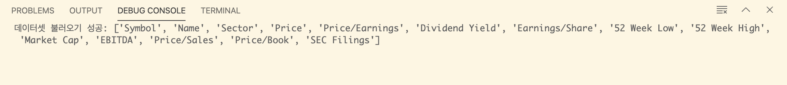

불러오기에 성공한 것을 확인했습니다. 이 과제에서 사용된 데이터셋은 *S&P 500 Index*에 등록된 미국 주식 시장 내 상위 500개 기업의 주식 정보를 담고 있습니다. **출처는 [이곳](https://datahub.io/core/s-and-p-500-companies-financials)에서 확인할 수 있습니다.**


이제 데이터셋에 담긴 정보를 확인해 보겠습니다.

```python
rk.unique_record() # 데이터셋의 필드 및 고유 값 확인
```

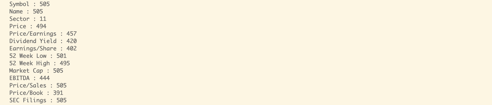

다음과 같이 총 14개의 필드가 있는 것을 확인했습니다.

각 필드에 대한 설명은 다음과 같습니다.

> 1. Symbol: 주식 시장에서 사용되는 전용 식별 부호입니다. 알파벳 3자리로 이루어지며 기업의 명칭에서 따옵니다.
> 2. Name: 기업의 이름입니다.
> 3. Sector: 해당 기업이 속한 산업 분야입니다. 총 11개의 분야로 구성되어 있는 것을 확인할 수 있습니다.
> 4. **Price**: **주식거래가**입니다. 이 과제에서 **예측 대상으로 쓰일 필드**입니다. 단위는 달러입니다.
> 5. Price/Earnings: 주가수익률입니다. 주가를 주당순이익(Earnings/Share)으로 나눈 값입니다. 예를 들어 주가 10000원짜리 기업이 주당 1000원의 순익을 거뒀다면 주가수익률은 10배가 되는 방식입니다.
> 6. Dividend Yield: 배당수익률입니다. 배당수익률은 주가 대비 매년 얼마의 배당금을 지급하는지를 나타내는 비율입니다. 즉 현재 주가로 주식을 매수할 경우 배당으로 몇%의 수익률을 올릴 수 있는지 알 수 있습니다.
> 7. Earnings/Share: 주당순이익입니다. 1주당 얼마의 이익을 창출하였느냐를 나타내는 지표로 보통 1년 단위로 1주당 수익 지표라 할 수 있습니다.
> 8. 52 Week Low: 전년 주식 시장에서 가장 낮게 거래된 주식의 가격입니다.
> 9. 52 Week High: 전년 주식 시장에서 가장 높게 거래된 주식의 가격입니다.
> 10. Market Cap: 시가총액입니다. 주식을 시장가치로 평가한 총액을 뜻하며, 어떠한 기업에서 발행한 주식수(outstanding shares)에 주가(share price)를 곱하면 됩니다.
> 11. EBITDA: 이자비용(Interest), 세금(Tax), 감가상각 비용(Depreciation & Amortization) 등을 빼기 전 순이익을 의미합니다.
> 12. Price/Sales: 주가매출비율입니다. 특정종목의 시가총액을 매출액으로 나눈 값, 혹은 주가를 1주당 매출액으로 나눈 수치입니다.
> 13. Price/Book: 장부가격입니다. 기업 회계장부에 기재된 가격으로 장부에 기입된 시점에서의 가격을 뜻합니다.
> 14. SEC Filings: 해당 주식거래 정보의 출처입니다.


이제 불필요한 필드를 제거하고, 다시 데이터셋을 확인해보겠습니다.

```python
rk.drop(['Symbol', 'Name', 'SEC Filings']) # 불필요한 필드 제거
rk.show(10) # 불필요한 필드가 제거된 데이터셋 확인
```

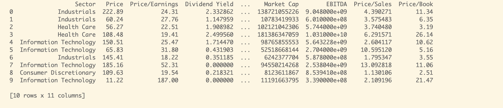

Symbol, Name, SEC Filings가 제거된 것을 확인했습니다.


### 2. 데이터 시각화하기

기계를 학습시키려면 상관관계가 있는 필드를 모두 알아내야겠죠? 따라서 데이터를 분석하기 위한 시각화를 진행합니다. 먼저 열지도로 데이터를 나타내겠습니다.

```python
rk.heatmap()
```

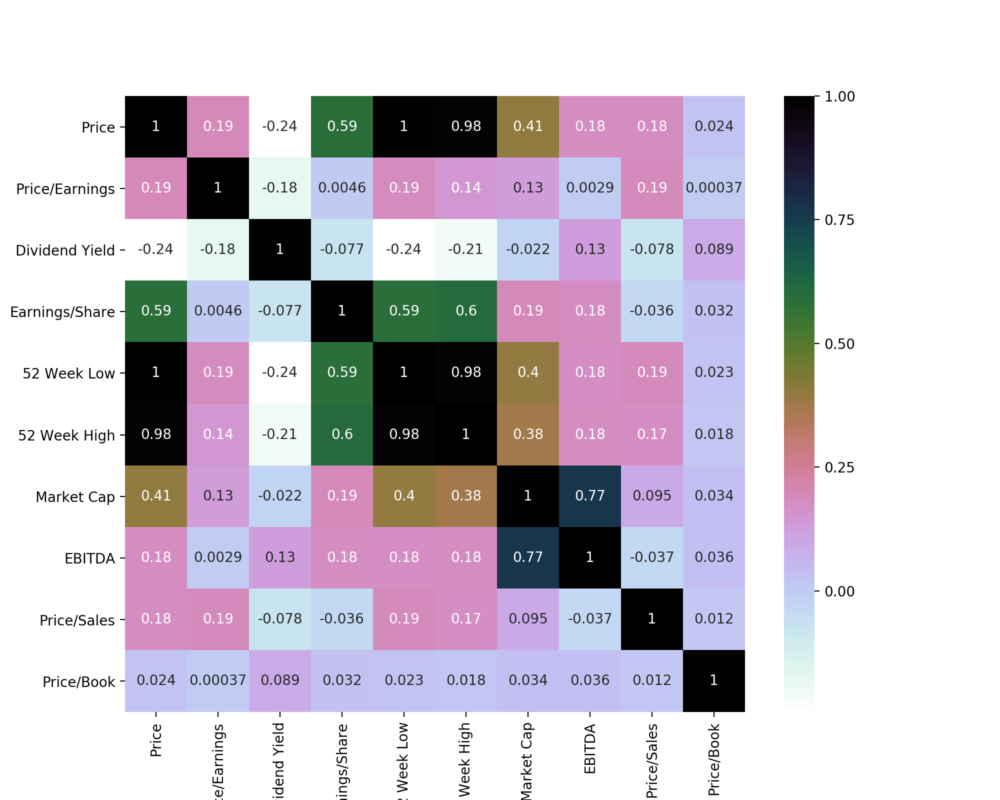

모든 필드 간 상관관계를 열지도로 나타냈습니다. 분석 내용은 다음과 같습니다.

> 상관관계가 높은 필드:
>
> Price & 52 Week Low : 1
>
> Price & 52 Week High : 0.98
>
> 52 Week Low & 52 Week High : 0.98
>
> Earnings/Share & Price : 0.59
>
> Earnings/Share & 52 Week Low : 0.59
>
> Earnings/Share & 52 Week High : 0.6
>
> EBITDA & Market Cap : 0.77


열지도로부터 얻은, 상관관계가 높은 필드만 따로 골라내어 다시 시각화를 진행합니다. 이번엔 pairplot을 이용해 보겠습니다.

```python
rk.pairplots(['Price', '52 Week Low', '52 Week High', 'Earnings/Share'], 'Sector')
rk.pairplots(['EBITDA', 'Market Cap'], 'Sector')
```

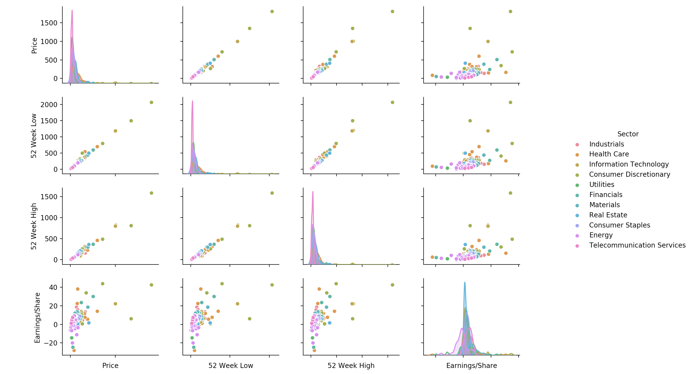

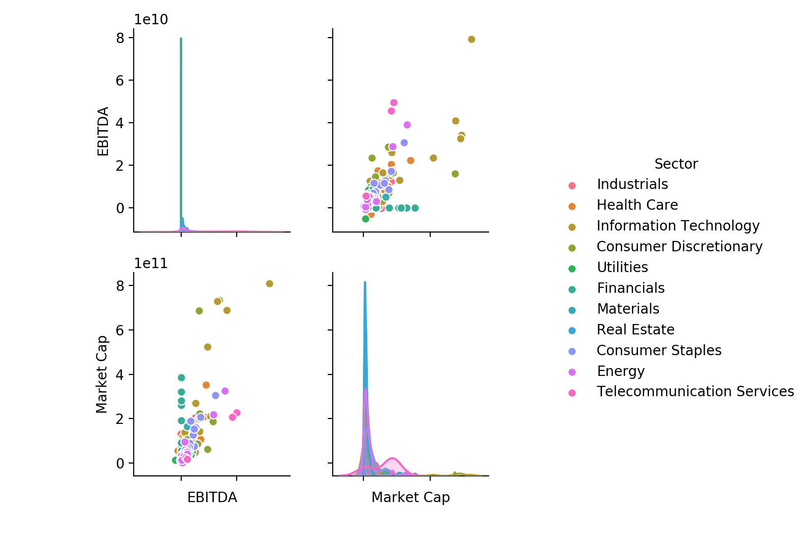

상관관계가 높은 모든 필드를 1대 1로 짝지었을 때 개별적 상관관계를 확인할 수 있습니다. 이를 통해 알아낸 사실은 다음과 같습니다.

> 1. Price, 52 Week Low, 52 Week High : 세 필드는 서로 매우 높은 상관관계를 보입니다. 해당 필드로 기계를 학습할 경우 Bias가 낮지만, Variance가 매우 높을 위험이 있습니다.
>
> 2. Earnings/Share에 대한 Price, 52 Week Low, 52 Week High: 이 네가지 상관관계는 비교적 낮은 상관관계를 보이고, 아웃라이어가 다수 존재합니다. Bias는 높지만, Variance가 낮을 것으로 예상됩니다.
>
> 3. EBITDA와 Market Cap: 1과 2 중간의 적당한 상관관계를 갖고 있습니다.


이 모든 필드의 관계를 한눈에 볼 수 있을까요? 이를 위해 3차원 그래프에 모든 정보를 담아보겠습니다.

```python
rk.plot3d('52 Week Low', '52 Week High', 'Price', 'Market Cap', 'Sector', 'EBITDA')
```

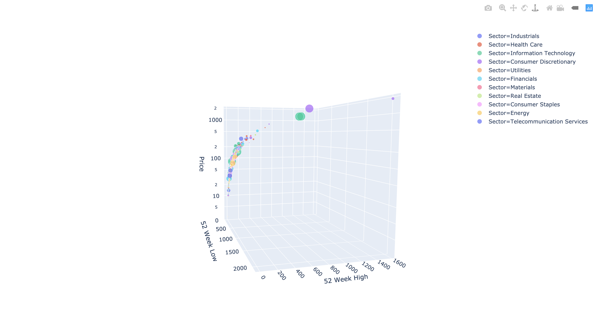

정면에서 본 그래프입니다.

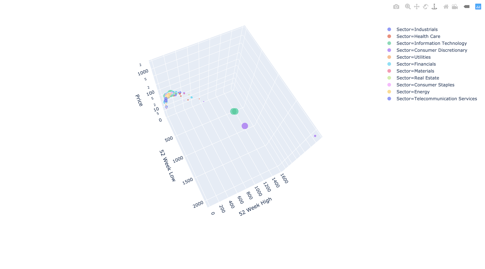

위에서 내려다 본 그래프입니다.

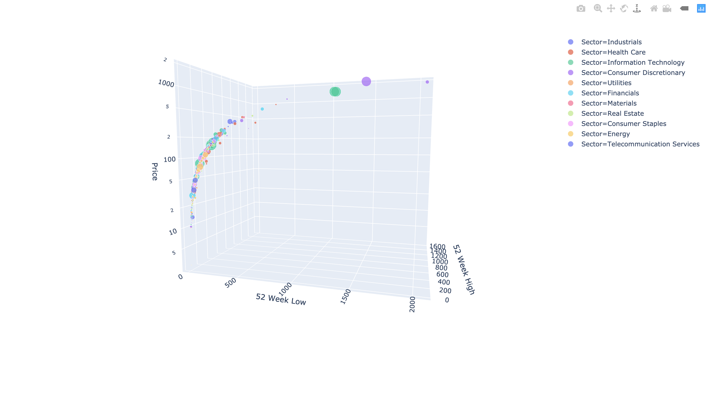

측면에서 본 그래프입니다.

이렇게 모든 필드의 정보를 한 눈에 확인했습니다. 이 그래프는 *plotly*라는 특수 데이터 시각화 라이브러리를 이용해 구현했습니다. 오픈 소스이며 `pip install plotly`로 내려받아 사용할 수 있습니다. 자세한 정보는 [이곳](https://plot.ly/python/)을 참고하세요.


지금까지 시각화된 그래프는 모두 Sector 별로 데이터 색을 다르게 넣었습니다. 이 Sector 필드 역시 기계 학습에 유용하게 쓰일 수 있을까요? boxplot을 이용해 확인해 보겠습니다.

```python
rk.boxplot('Sector', 'Price')
```

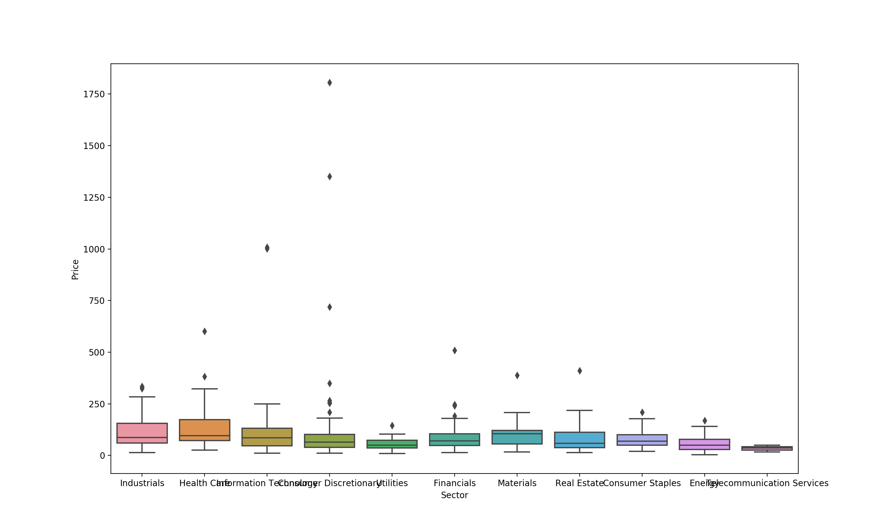

11개의 분야 별로 주식거래가가 모두 비슷하고, 매우 넓은 범위에 걸쳐 아웃라이어가 분포해 학습에 쓰일만한 자료로 보이지 않습니다. Sector를 빼도 괜찮겠네요!


이러한 데이터 분석을 통해, 기계를 학습시키기에 유용한 필드를 골라냈습니다.


### 3. 기계 학습시키기

이제 본격적으로 기계를 학습시킬 시간입니다. RegressorKit에 준비된 학습모델은 모두 11개입니다.

> **선형 모델**
>
> 1. Linear Regression
>
> 2. Ridge Regression
>
> 3. Lasso Regression
>
> 4. Elastic-net Regression
>
> **비선형 모델**
>
> 1. K-Nearest Neighbors Regression
>
> 2. Support Vector Machine Regression
> 3. Decision Tree Regression
>
> **앙상블 모델**
>
> - 앙상블 모델의 패러미터는 모두 GridSearchCV를 이용해 찾아낸 최적의 값으로 설정되었습니다. 컴파일이 지나치게 오래 걸리는 관계로 이 라이브러리에서 GridSearchCV를 사용하지는 않습니다.
>
> 1. Random Forest Regression
>
> 2. Adaboost Regression
>
> 3. Gradient Boosting Regression
>
> 4. XGBoost Regression


2장에서 얻어낸 기계 학습용 필드 `'52 Week Low', '52 Week High', 'Earnings/Share', 'EBITDA', 'Market Cap'`을 이용해 `'Price'`를 예측해 보겠습니다.


#### 3-1. 선형 회귀 모델

```python
rk.linear(['52 Week Low', '52 Week High', 'Earnings/Share', 'EBITDA', 'Market Cap'], 'Price')
```

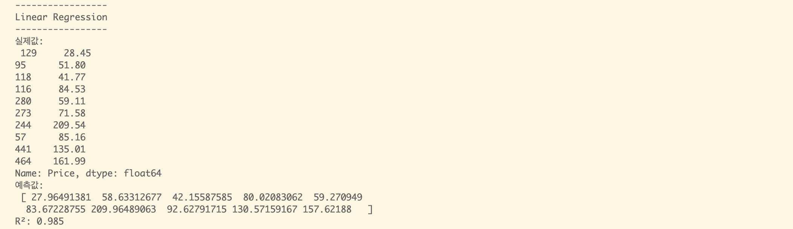

> R제곱은 결정계수를 나타냅니다. 결정계수는 해당 기계 학습모델의 성능을 나타내는 지표로, Score로 나타내기도 합니다. 선형 회귀 모델은 0.985로 상당히 높은 것을 알 수 있습니다.


#### 3-2. 리지 회귀 모델

```python
rk.ridge(['52 Week Low', '52 Week High', 'Earnings/Share', 'EBITDA', 'Market Cap'], 'Price')
```

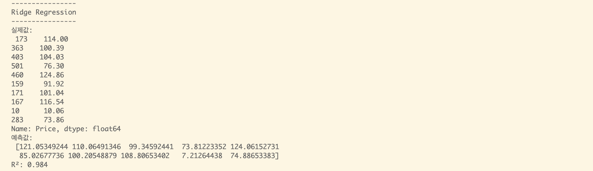

> 결정계수 0.984


#### 3-3. 라소 회귀 모델


```python
rk.lasso(['52 Week Low', '52 Week High', 'Earnings/Share', 'EBITDA', 'Market Cap'], 'Price')
```

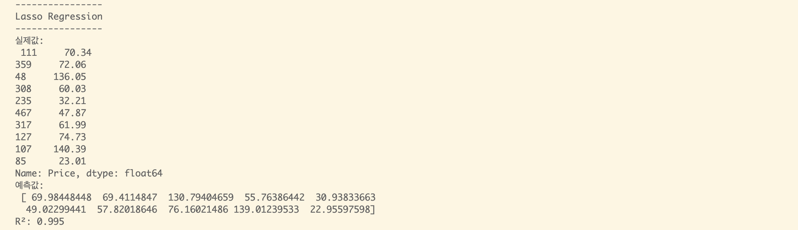

> 결정계수 0.995


#### 3-4. 엘라스틱 넷 회귀 모델


```python
rk.elastic_net(['52 Week Low', '52 Week High', 'Earnings/Share', 'EBITDA', 'Market Cap'], 'Price')
```

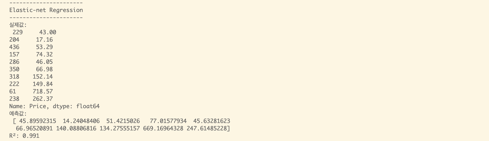

> 결정계수 0.991


#### 3-5. K만큼 가까운 이웃맺기 모델


```python
rk.KNN(['52 Week Low', '52 Week High', 'Earnings/Share', 'EBITDA', 'Market Cap'], 'Price')
```

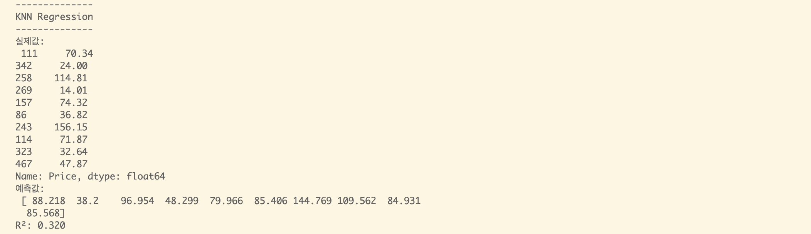

> 결정계수 0.320
>
> 성능이 상당히 좋지 않은 것을 확인할 수 있습니다. KNN 모델은 이 데이터셋에 적합하지 않은 것으로 보입니다.


#### 3-6. 서포트 벡터 머신 모델


```python
rk.SVM(['52 Week Low', '52 Week High', 'Earnings/Share', 'EBITDA', 'Market Cap'], 'Price')
```

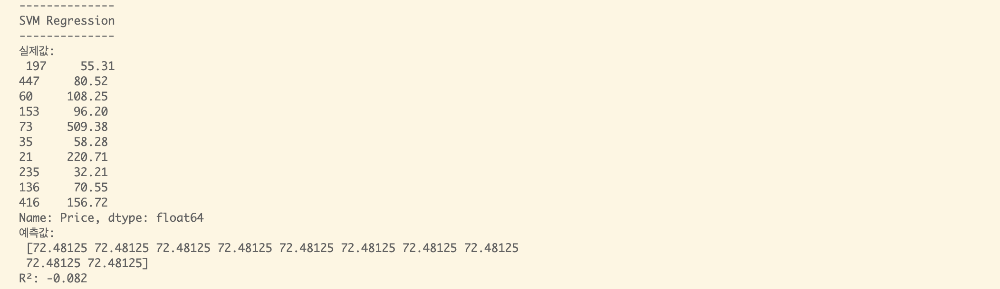

> 결정계수 -0.082
>
> 결정계수 R제곱이 0에서 1 사이의 값으로 표현되어야 하는 점을 고려한다면, SVM 모델 역시 이 데이터셋에 매우 부적합하다는 것을 확인할 수 있습니다.


#### 3-7. 결정 나무 모델


```python
rk.decision_tree(['52 Week Low', '52 Week High', 'Earnings/Share', 'EBITDA', 'Market Cap'], 'Price')
```

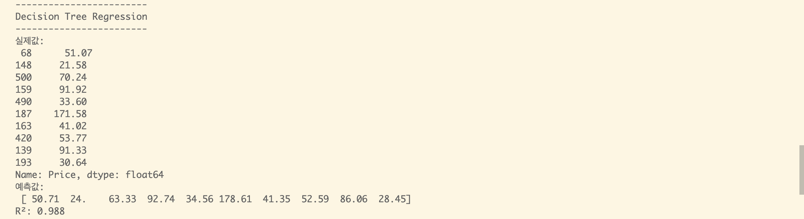

> 결정계수 0.988


#### 3-8. 무작위 숲 모델

```python
rk.random_forest(['52 Week Low', '52 Week High', 'Earnings/Share', 'EBITDA', 'Market Cap'], 'Price')
```

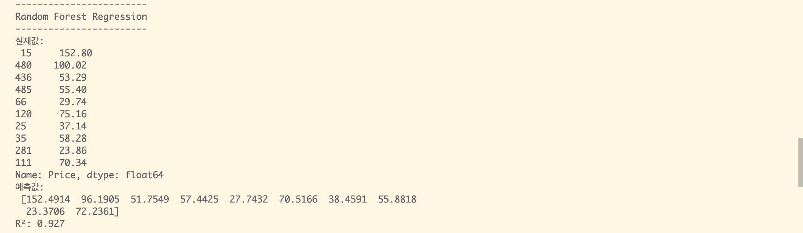

> 결정계수 0.927


#### 3-9. 적응형 부스팅 모델

```python
rk.adaboost(['52 Week Low', '52 Week High', 'Earnings/Share', 'EBITDA', 'Market Cap'], 'Price')
```

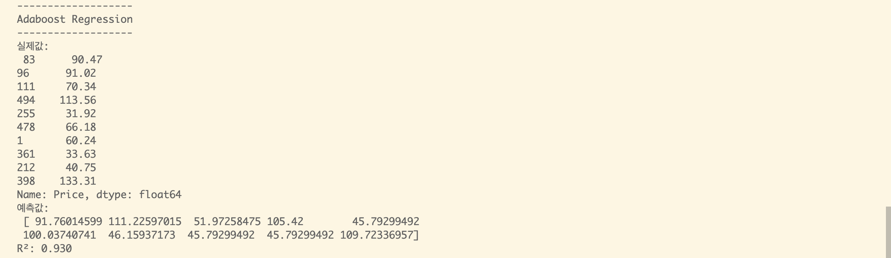

> 결정계수 0.930


#### 3-10. 경사 부스팅 모델

```python
rk.gradient_boost(['52 Week Low', '52 Week High', 'Earnings/Share', 'EBITDA', 'Market Cap'], 'Price')
```

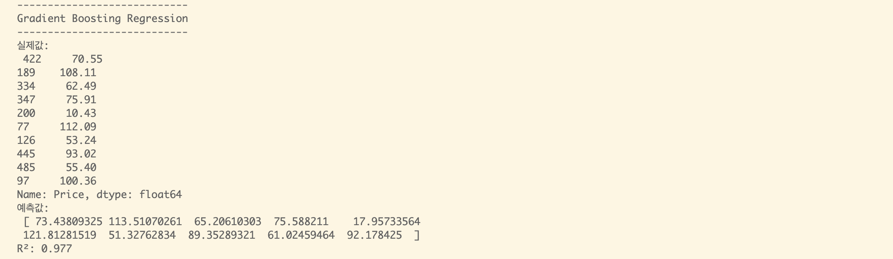

> 결정계수 0.977


#### 3-11. 극한 경사 부스팅 모델

```python
rk.xgboost(['52 Week Low', '52 Week High', 'Earnings/Share', 'EBITDA', 'Market Cap'], 'Price')
```

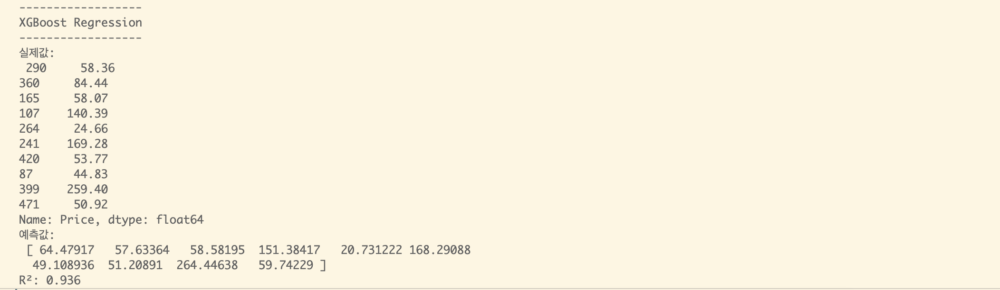

> 결정계수 0.936
>
> 극한 경사 부스팅, 또는 XGBoost는 *sklearn*이 아닌 전용 라이브러리 *xgboost*를 활용했습니다.


### 정리

지금까지 11개의 회귀 모델을 적용시켜 기계를 학습시켰습니다. 라소 회귀 모델이 가장 뛰어난 성능을 보여주었고, 다른 선형 모델들과 앙상블 모델 역시 기대에 부응하는 좋은 성능을 냈습니다. 한편 KNN 모델과 SVM 모델은 이 데이터셋에 적합하지 않은 모델이라는 사실 역시 알 수 있었습니다.
